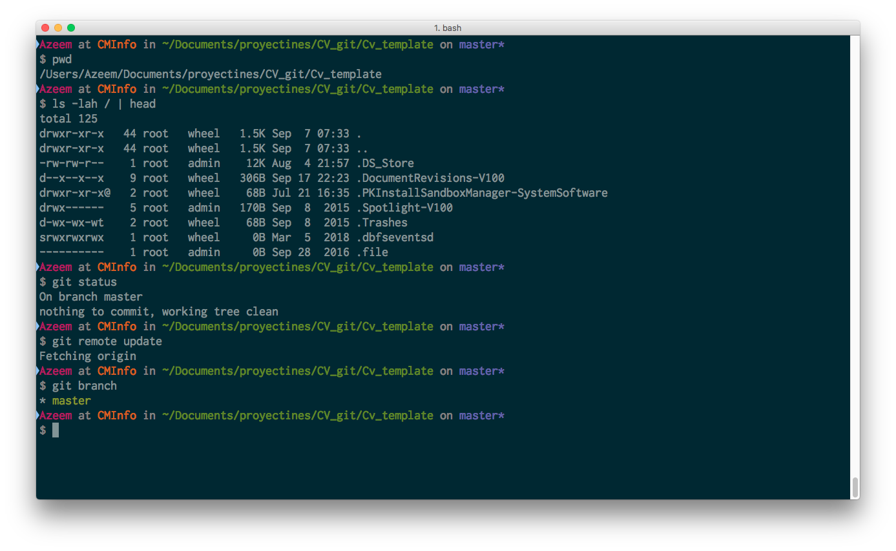

# .bashrc, .bash_profile configuration  
My .bashrc prompt configuration in order to have a better terminal view.

Just run the follow command: ```sudo config.sh```, it will make a copy of the original .bashrc, .bash_profile files, and it'll add the prompt configuration in both files.
## Example screenshot 


## Reload terminal to applying changes
```source ~/.bash_profile```

### Disclaimer
I don't own this modifications.  
All rights are reserved to the author.
(https://github.com/gf3/dotfiles)
